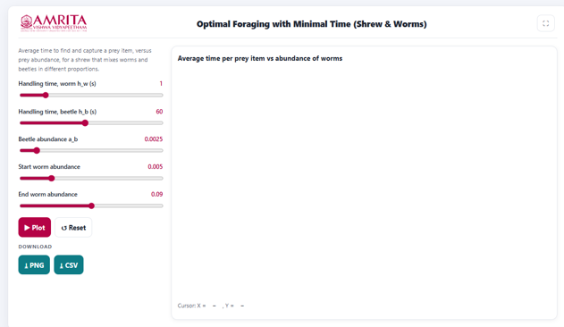
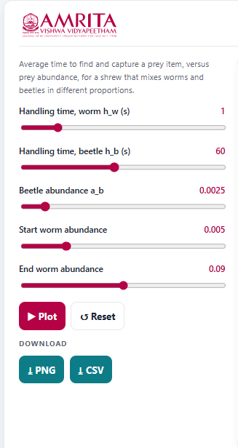
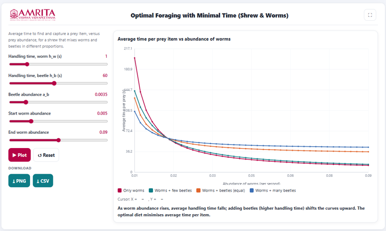

### Procedure

1. The simulator enables users to investigate how a predator minimizes the average time required to locate and capture prey under varying prey abundances. Users can configure prey handling times and prey abundances, execute the simulation, and analyze the influence of prey availability on the predator's foraging efficiency.

 
&nbsp;

2. The simulator consists of a parameter panel on the left and a graphical visualization panel on the right.

 
&nbsp;

3. Read the introductory description displayed at the top of the parameter panel. This section explains that the simulation evaluates the average time required to locate and capture a prey item under different abundances of worms and beetles, thereby illustrating the principle of time-minimizing foraging behaviour.
 
&nbsp;

4. Adjust the handling time for worms (h₍w₎) using the corresponding slider. This parameter specifies the average time required by the shrew to capture and consume an individual worm.
 
&nbsp;

5. Adjust the handling time for beetles (h₍b₎) using the corresponding slider. This parameter defines the average time required to capture and consume an individual beetle.
 
&nbsp;

6. Specify the abundance of beetles (a₍b₎) using the corresponding slider. This parameter represents the density or availability of beetles within the foraging habitat.
 
&nbsp;

7. Specify the starting worm abundance using the Start worm abundance slider. This parameter defines the lower limit of the worm abundance range used for generating the graph.
 
&nbsp;

8. Specify the ending worm abundance using the End worm abundance slider. Together with the starting value, this parameter defines the complete range of worm abundances over which the simulation is performed.
 
&nbsp;

9. After configuring all simulation parameters, click the Plot button to execute the simulation and generate the graphical output

 
&nbsp;

10. Observe the graph displayed in the visualization panel. The graph illustrates the variation in the average time required to locate and capture a prey item with increasing worm abundance under different diet compositions.
 
&nbsp;

11. Interpret the X-axis (Abundance of worms) to examine changes in the availability of worms within the habitat.
 
&nbsp;

12. Interpret the Y-axis (Average time per prey item, s) to determine the average time required by the predator to obtain a prey item under each dietary strategy.
 
&nbsp;

13. Use the graph legend to distinguish the four diet compositions represented in the graph:

* Only worms

* Worms + few beetles

* Worms + beetles (equal proportions)

* Worms + many beetles
 
&nbsp;

14. Compare the curves to examine how the average time per prey item changes with increasing worm abundance for each diet composition.
 
&nbsp;

15. Observe the effect of increasing worm abundance on the average time required to obtain food. Compare the average time at low worm abundance with that observed at higher worm abundance.
 
&nbsp;

16. Compare the different dietary strategies to determine how the inclusion of beetles, which require longer handling times, influences the overall foraging efficiency of the predator.
 
&nbsp;

17. Read the interpretation message displayed below the graph. This message summarizes the simulation results and explains how increasing worm abundance reduces the average time per prey item, whereas increasing the proportion of beetles shifts the curves upward because of their greater handling time.
 
&nbsp;

18. Move the cursor over the graph, if required, to display the corresponding coordinate values shown beneath the graph. These values indicate the average time required to obtain a prey item at a specific worm abundance.
 
&nbsp;

19. Modify one or more simulation parameters, such as the handling time for worms, handling time for beetles, beetle abundance, or the range of worm abundance, and generate the graph again to investigate how these factors influence the predator's foraging efficiency.
 
&nbsp;

20. If required, click the Reset button to restore the default simulation parameters before performing another simulation.
 
&nbsp;

21. Download the graphical output by clicking the PNG button or export the numerical simulation data by clicking the CSV button for further analysis and comparison.
 
&nbsp;

22. Repeat the above procedure using different combinations of prey abundances and handling times to compare alternative dietary strategies and identify the conditions that minimize the average time required to obtain a prey item.
 
&nbsp;

23. Observe the generated graph displayed in the visualization panel. The graph illustrates the relationship between the average time required to obtain a prey item and the abundance of worms under the specified ecological conditions.
 
&nbsp;

24. If required, click the Reset button to restore the default simulation parameters before performing another simulation.
 
&nbsp;

25. Download the graphical output by clicking the PNG button or export the numerical simulation data by clicking the CSV button for further analysis and documentation.
 
&nbsp;

26. Repeat the above procedure using different combinations of prey handling times and prey abundances to investigate how variations in prey availability influence the predator's foraging efficiency and determine the conditions that minimize the average time required to obtain food.
 
&nbsp;

 
&nbsp;

