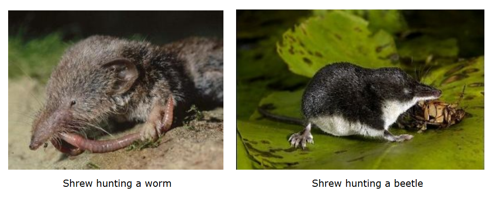
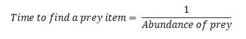
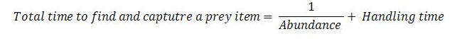
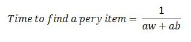
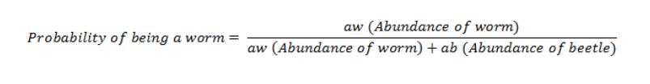
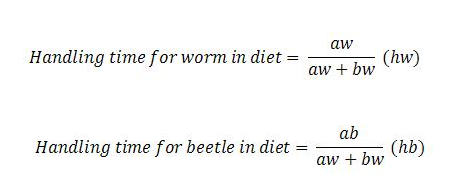
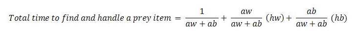

&nbsp;

Population density of predators mainly depends upon their food. Individual obtain more food than their ‘share’ will leave and supply more offspring than an individual with less or no food (it include finding /catching /killing their prey. This area of study in population ecology is called optimal foraging theory.Optimal foraging theory was first proposed by Robert MacArthur, J M Emlen, and Eric Pianka in 1966.The first assumption of the optimal foraging theory is natural selection will only favor behavior that maximizes energy return.

Optimal foraging theory helps biologist to understand the factors determining a consumer’s operation range of food types. Predators are categories into two searching and sit-and-wait. A searching predator moves throughout its habitat and find its prey. A sit-and-wait predator waits for its prey to near its point of observation. In this experiment we will study the behavior of searching predators.

 
&nbsp;

Search time and handling time is important step in a predation. For example consider a shrew, which moves across the forest for searching its prey (insect, worm, snails,etc). They also escape form their own predator mainly owls. If a shrew spends more time to its foraging, then there is higher chance of being killed. A successful shrew is one who leaves more offspring and it spends less energy to find its prey. The time period takes by the predator to find its next prey after a predation is called searching time. Suppose a prey was found and the time period takes to catch that prey is called handling time. It mainly depends upon the behavior of the prey.

Search time is inversely proportional to prey abundance. The abundance of prey mainly depends upon the choice of a shrew, if it takes more worms , worms population become less, search timer increases. Handling time mainly depends on the behavior of the prey. Handling time will be less to capture a worm than a beetle, because it can move faster when compare to worms.

 
&nbsp;

Abundance is expressed in seconds. For example a prey abundance of 100 worms/square meter may be expressed as 3 worms per second. Including handling time to total foraging time, then the equation become.

 
&nbsp;

Consider a situation that, a shrew decided to eat both worms and beetles, then the abundance of the prey must be aw (abundance of worm) + ab (abundance of beetle). So the average time it takes to find something to eat is given by:

 
&nbsp;

As explained above handling time is the time a predator takes to capture a prey. It mainly depends upon the behavior of the prey. What is the probability that, encountered prey item is a worm?

 
&nbsp;

Handling time for the worm component of the diet is then the probability of being a worm times handling time for a worm.

 
&nbsp;

Average time will take a shrew to find and capture a prey item , when foraging for both worm and beetle is given by:

 
&nbsp;

&nbsp;

